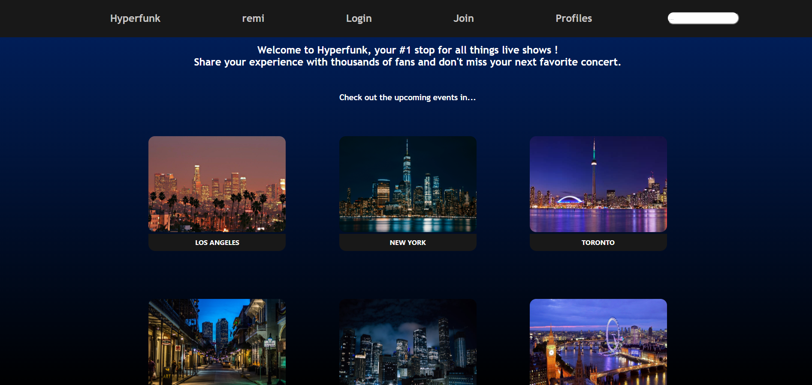
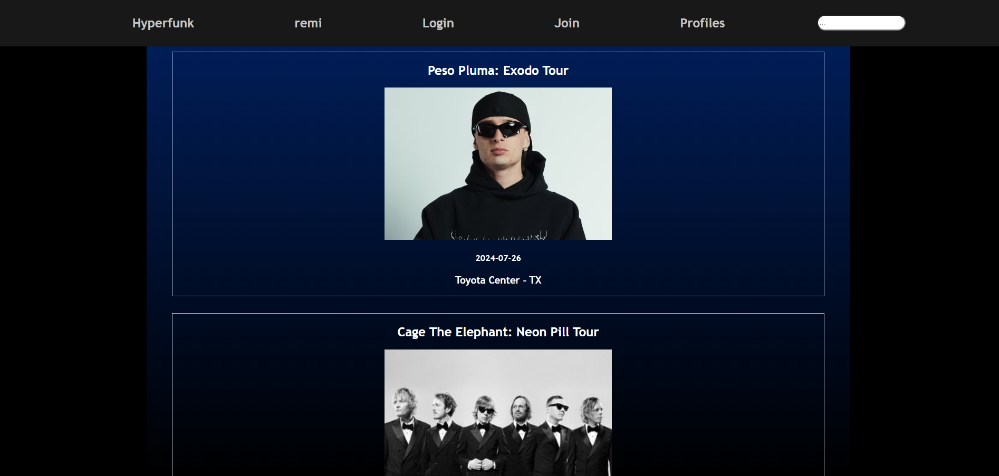

# [Hyperfunk](https://hyperfunk.vercel.app/)
A learning student project, vibrant platform Hyperfunk aims to present concerts and connect live music amateurs all over the globe. Users will soon be able to set up a profile, view the world's most popular tours and look through the nearest upcoming events.

Built with HTML, CSS and Vanilla JavaScript, Hyperfunk fetches data from the Ticketmaster API to provide all the information needed before booking a ticket.

